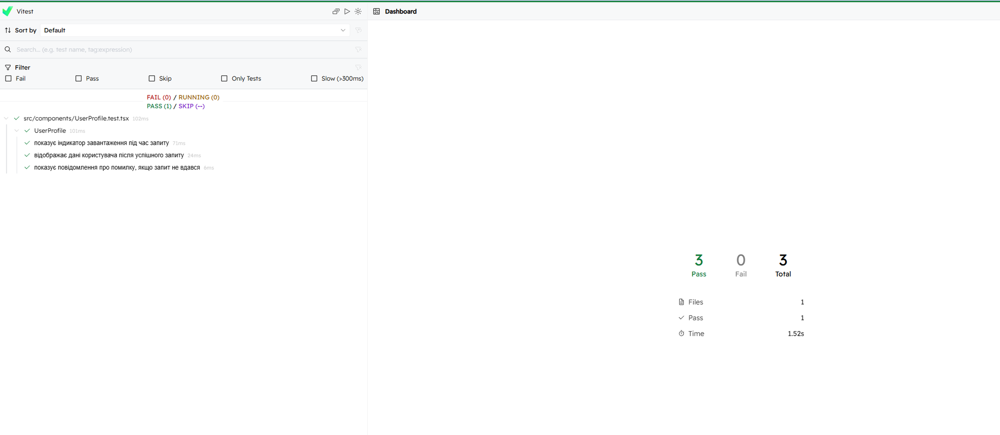

# Home Work 46 — UserProfile

Невеликий React + TypeScript застосунок на Vite. Компонент `UserProfile` виконує асинхронний GET-запит до [JSONPlaceholder](https://jsonplaceholder.typicode.com/users/1) та відображає дані користувача, індикатор завантаження та повідомлення про помилку.

## Стек

- React 19 + TypeScript
- Vite
- Vitest + @testing-library/react (тести з мокуванням API)

## Встановлення та запуск

```bash
npm install
npm run dev
```

Застосунок буде доступний на `http://localhost:5173`.

## Тести

```bash
npm test
```

Усі тести покривають три сценарії роботи `UserProfile`: завантаження, успішне відображення даних користувача та помилку запиту.



## Структура проекту

```
src/
├── api/            # запити до сервера
│   ├── client.ts
│   └── users.ts
├── components/
│   ├── UserProfile.tsx
│   └── UserProfile.test.tsx
├── constants/
│   └── config.ts
├── types/          # типи і інтерфейси
│   ├── models.ts
│   └── components.ts
├── App.tsx
└── main.tsx
```